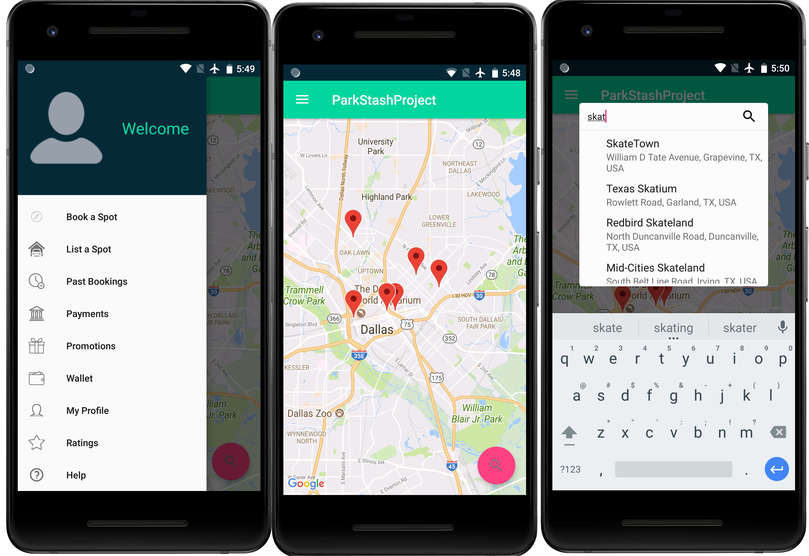

ParkStash project
==========

A coding challenge

 

## Setup

Clone this project and open it with Android studio

Create a new string resource file under `values`, name it whatever you want and add your google API key

```xml
<resources>
    <string name="google_api_key">YOUR-API-KEY</string>
</resources>
```